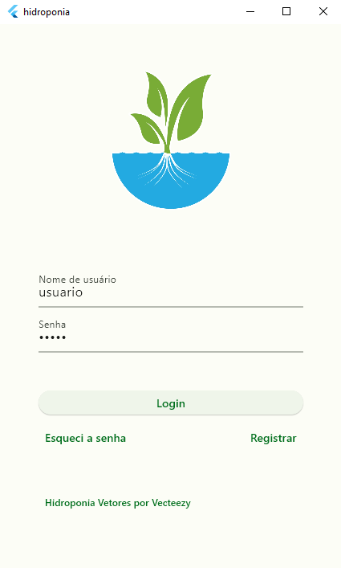
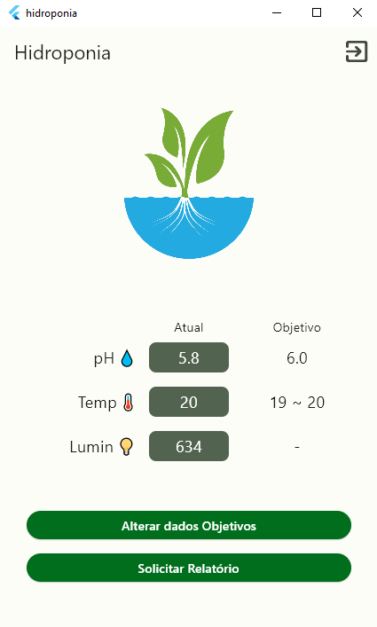
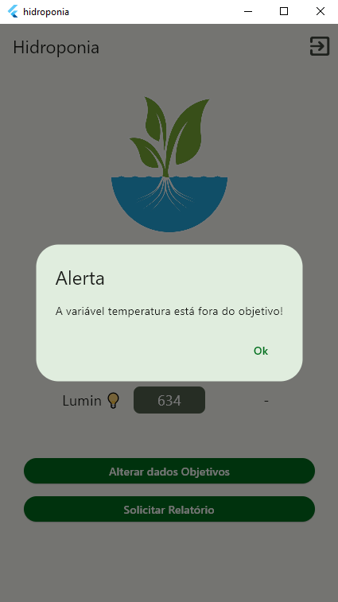
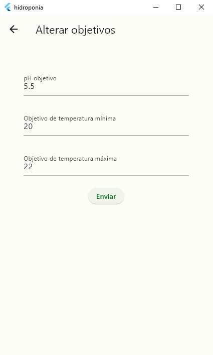
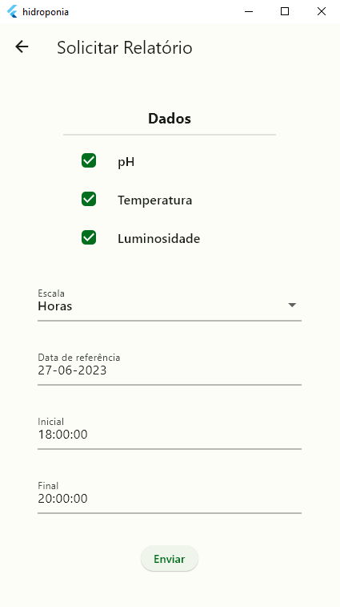
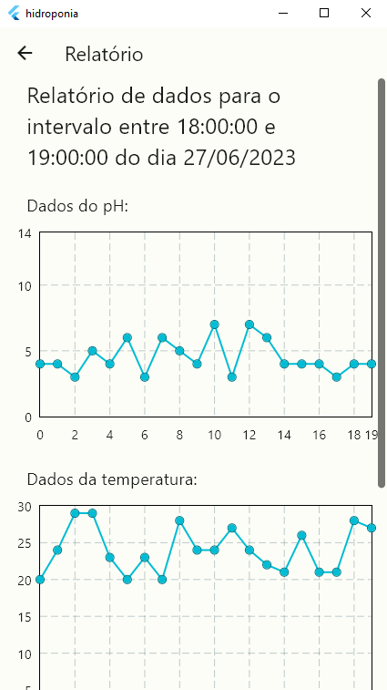

# Projeto de Monitoramento e Controle de Hidroponia

## Sumário
- [Introdução](#introdução)
- [Diagrama de Atividades](#diagrama-de-atividades)
- [Páginas e Funcionalidades](#páginas-e-funcionalidades)
- [Requisitos de Funcionamento](#requisitos-de-funcionamento)

## Introdução

Este repositório contém os códigos para um cliente que exibe e controla as variáveis de um sistema hidropônico utilizando uma comunicação por mensagens entre o cliente, um microcontrolador ESP8266 e um servidor Java. A comunicação é feita através de uma instância ActiveMQ implementada na AWS sob a AmazonMQ. O protocolo utilizado para a comunicação entre o cliente e o broker é STOMP over web socket da biblioteca stomp_dart_client.

Este projeto foi feito em conjunto com [Flávio Augusto Aló Torres](<https://github.com/flavio055063>) e [Lucas Batista Pereira](<https://github.com/Perebati>) para a disciplina Sistemas Distribuídos, ministrada por [Rafael Frinhani](<https://www.linkedin.com/in/rafael-frinhani-20aa7b29/>) em 2023.

O documento completo do projeto pode ser acessado em:
https://drive.google.com/file/d/1YUD_zvchzOm1U5ZP10D-9Lv06UssnCoe/view?usp=sharing

## Diagrama de Atividades

De forma geral, a execução do programa pode ser observada através do seguinte diagrama de atividades:

Em resumo, o cliente é responsável por exibir as informações que o microcontrolador envia, exibir possíveis alertas quando uma variável estiver fora do limite estipulado, alterar os limites das variáveis e solicitar relatórios dos dados que estão armazenados no backend.

## Páginas e Funcionalidades

As páginas que o usuário poderá interagir são exibidas a seguir.

Primeiramente, é necessário o login com suas credenciais que devem estar cadastradas no banco de dados e ligadas à um tópico de um microcontrolador específico.

Após a realização do login, o usuário será redirecionado à página principal onde pode ver as variáveis de controle assim como o objetivo/limite para tais variáveis.

Caso ocorra algum imprevisto no controle das variáveis, o usuário receberá um alerta dentro do aplicativo informando o problema. O layout desse alerta também é utilizado para informar outros erros como de login ou conexão.

O controle do limite destas variáveis é feita através de uma outra página, onde o usuário irá ver os limites atuais, poderá alterá-los e em seguida enviar uma solicitação para que haja uma atualização tanto no banco de dados quanto no microcontrolador.

Também na página principal, o usuário também poderá navegar para uma outra página para realizar a solicitação de relatórios dos dados desejados, dentro de uma janela de tempo definida também pelo usuário.

Após a solicitação do relatório, o backend irá compilar os resultados e responder com os dados necessários, onde o cliente irá formatar essas informações para um gráfico.

## Requisitos de funcionamento

Para utilizar o programa é necessário atualizar as dependências através do comando ``pub get``, também é necessário que haja um arquivo ``credentials.dart`` no diretório ``lib`` contendo as variáveis ``urlAppCredential, userAppCredential, passcodeAppCredential`` para a conexão com o broker AWS.