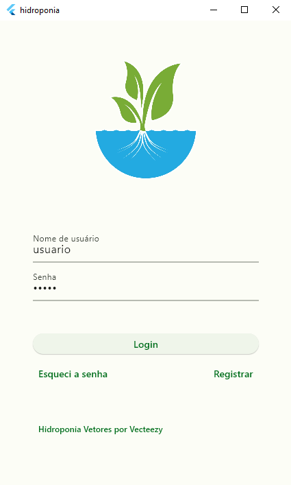
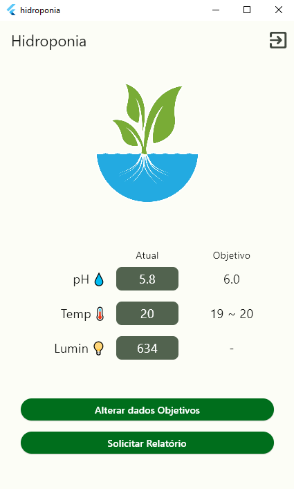
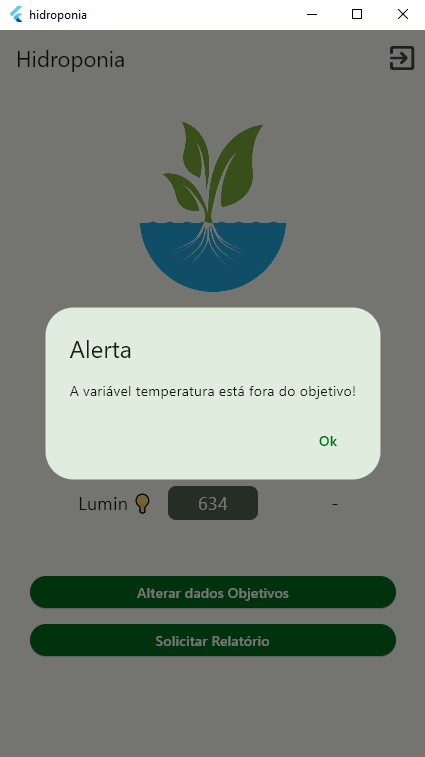
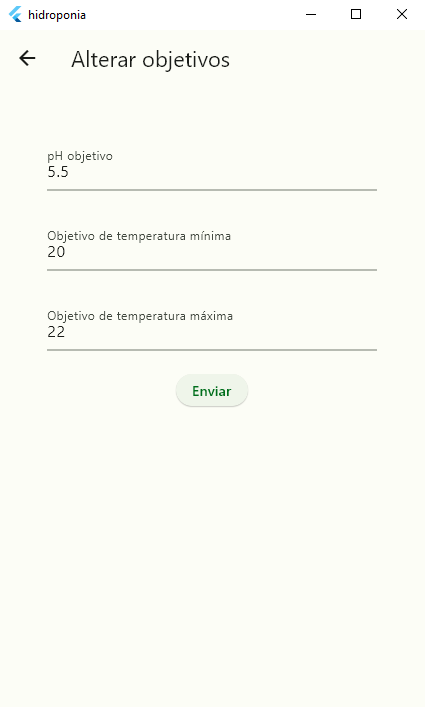
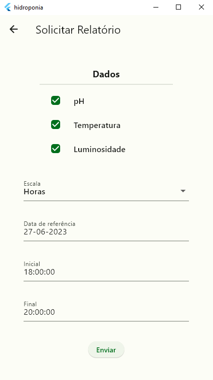
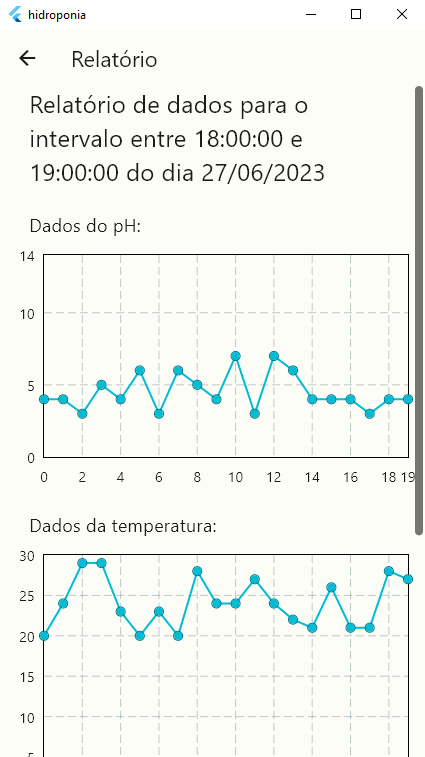

### 🇺🇸 English

# Hidroponic Garden Monitoring and Control Project

## Summary
- [Introduction](#introduction)
- [Activity Diagram](#activity-diagram)
- [Pages and Features](#pages-and-features)
- [Run Requirements](#run-requirements)

## Introduction

This repository contains the code for a client that monitors and controls the variables of a hydroponic system using a message-based communication between client, an ESP8266 microcontroller and a Java server. The communication is made through an ActiveMQ instance implemented in AWS under AmazonMQ. The protocol used for the client-broker communication is `STOMP over websocket` from the `stomp_dart_client` library.

This project was made with the help of [Flávio Augusto Aló Torres](<https://github.com/flavio055063>) and [Lucas Batista Pereira](<https://github.com/Perebati>) for the Distributed Systems subject, taught by [Rafael Frinhani](<https://www.linkedin.com/in/rafael-frinhani-20aa7b29/>) in 2023.

## Activity Diagram

Overall, the program execution can be observed by the following activity diagram (in Portuguese):

In summary, the client is responsible for displaying the information that the microcontroller sends, displaying possible alerts when a variable is outside of the set limit, altering the variable limits, and requesting data reports that are stored in the backend.

## Pages and Features

The pages that the user can interact with are shown below.

Firstly, the user is required to log in with their credentials, which should be registered beforehand in the database and tied to a specific microcontroller topic.

After logging in, the user will be redirected to the main page where they can see the control variables and the target/limit for such variables.

If some unexpected event happens in the variable control, the user will receive an alert inside the app informing about the problem. The layout of this alert is also used to inform other errors such as about login or connection.

The control of the variable limits is done from another page, where the user can see the current limits, change them and also send an update request to both the microcontroller and the backend.

Also on the main page, the user can navigate to another page to request a data report, within a time frame also user-defined.

After requesting the report, the backend will compile the results and respond with the necessary data, where the client will format such data in a graph.

## Run Requirements

To use this program it is required to update the dependencies through the `pub get` command. It's also required to have a `credentials.dart` file in the `lib` directory containing the variables `urlAppCredential, userAppCredential, passcodeAppCredential` for the connection with the AWS broker.

🇧🇷 Portuguese

# Projeto de Monitoramento e Controle de Hidroponia

## Sumário
- [Introdução](#introdução)
- [Diagrama de Atividades](#diagrama-de-atividades)
- [Páginas e Funcionalidades](#páginas-e-funcionalidades)
- [Requisitos de Funcionamento](#requisitos-de-funcionamento)

## Introdução

Este repositório contém os códigos para um cliente que exibe e controla as variáveis de um sistema hidropônico utilizando uma comunicação por mensagens entre o cliente, um microcontrolador ESP8266 e um servidor Java. A comunicação é feita através de uma instância ActiveMQ implementada na AWS sob a AmazonMQ. O protocolo utilizado para a comunicação entre o cliente e o broker é STOMP over websocket da biblioteca stomp_dart_client.

Este projeto foi feito em conjunto com [Flávio Augusto Aló Torres](<https://github.com/flavio055063>) e [Lucas Batista Pereira](<https://github.com/Perebati>) para a disciplina Sistemas Distribuídos, ministrada por [Rafael Frinhani](<https://www.linkedin.com/in/rafael-frinhani-20aa7b29/>) em 2023.

O documento completo do projeto pode ser acessado em:
https://drive.google.com/file/d/1YUD_zvchzOm1U5ZP10D-9Lv06UssnCoe/view?usp=sharing

## Diagrama de Atividades

De forma geral, a execução do programa pode ser observada através do seguinte diagrama de atividades:

Em resumo, o cliente é responsável por exibir as informações que o microcontrolador envia, exibir possíveis alertas quando uma variável estiver fora do limite estipulado, alterar os limites das variáveis e solicitar relatórios dos dados que estão armazenados no backend.

## Páginas e Funcionalidades

As páginas que o usuário poderá interagir são exibidas a seguir.

Primeiramente, é necessário o login com suas credenciais que devem estar cadastradas no banco de dados e ligadas à um tópico de um microcontrolador específico.

Após a realização do login, o usuário será redirecionado à página principal onde pode ver as variáveis de controle assim como o objetivo/limite para tais variáveis.

Caso ocorra algum imprevisto no controle das variáveis, o usuário receberá um alerta dentro do aplicativo informando o problema. O layout desse alerta também é utilizado para informar outros erros como de login ou conexão.

O controle do limite destas variáveis é feita através de uma outra página, onde o usuário irá ver os limites atuais, poderá alterá-los e em seguida enviar uma solicitação para que haja uma atualização tanto no banco de dados quanto no microcontrolador.

Também na página principal, o usuário também poderá navegar para uma outra página para realizar a solicitação de relatórios dos dados desejados, dentro de uma janela de tempo definida também pelo usuário.

Após a solicitação do relatório, o backend irá compilar os resultados e responder com os dados necessários, onde o cliente irá formatar essas informações para um gráfico.

## Requisitos de funcionamento

Para utilizar o programa é necessário atualizar as dependências através do comando `pub get`, também é necessário que haja um arquivo `credentials.dart` no diretório `lib` contendo as variáveis `urlAppCredential, userAppCredential, passcodeAppCredential` para a conexão com o broker AWS.

